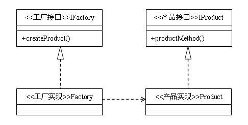

## 工厂方法模式
### 定义：定义一个用于创建对象的接口，让子类决定实例化哪一个类，工厂方法使一个类的实例化延迟到其子类。

### 类型：创建类模式
### 类图：


### 工厂方法模式代码
```java
interface IProduct {
    public void productMethod();
}
 
class Product implements IProduct {
    public void productMethod() {
        System.out.println("产品");
    }
}

interface IFactory {
    public IProduct createProduct();
}

class Factory implements IFactory {
    public IProduct createProduct() {
        return new Product();
    }
}

public class Client {
    public static void main(String[] args) {
        IFactory factory = new Factory();
        IProduct prodect = factory.createProduct();
        prodect.productMethod();
    }
}
```

### 工厂模式：

> 首先需要说一下工厂模式。工厂模式根据抽象程度的不同分为三种：简单工厂模式（也叫静态工厂模式）、本文所讲述的工厂方法模式、以及抽象工厂模式。工厂模式是编程中经常用到的一种模式。它的主要优点有：

* 可以使代码结构清晰，有效地封装变化。在编程中，产品类的实例化有时候是比较复杂和多变的，通过工厂模式，将产品的实例化封装起来，使得调用者根本无需关心产品的实例化过程，只需依赖工厂即可得到自己想要的产品。
* 对调用者屏蔽具体的产品类。如果使用工厂模式，调用者只关心产品的接口就可以了，至于具体的实现，调用者根本无需关心。即使变更了具体的实现，对调用者来说没有任何影响。
* 降低耦合度。产品类的实例化通常来说是很复杂的，它需要依赖很多的类，而这些类对于调用者来说根本无需知道，如果使用了工厂方法，我们需要做的仅仅是实例化好产品类，然后交给调用者使用。对调用者来说，产品所依赖的类都是透明的。

### 工厂方法模式：

> 通过工厂方法模式的类图可以看到，工厂方法模式有四个要素：

* 工厂接口。工厂接口是工厂方法模式的核心，与调用者直接交互用来提供产品。在实际编程中，有时候也会使用一个抽象类来作为与调用者交互的接口，其本质上是一样的。
* 工厂实现。在编程中，工厂实现决定如何实例化产品，是实现扩展的途径，需要有多少种产品，就需要有多少个具体的工厂实现。
* 产品接口。产品接口的主要目的是定义产品的规范，所有的产品实现都必须遵循产品接口定义的规范。产品接口是调用者最为关心的，产品接口定义的优劣直接决定了调用者代码的稳定性。同样，产品接口也可以用抽象类来代替，但要注意最好不要违反里氏替换原则。
* 产品实现。实现产品接口的具体类，决定了产品在客户端中的具体行为。

### 适用场景：

> 不管是简单工厂模式，工厂方法模式还是抽象工厂模式，他们具有类似的特性，所以他们的适用场景也是类似的。

* 首先，作为一种创建类模式，在任何需要生成复杂对象的地方，都可以使用工厂方法模式。有一点需要注意的地方就是复杂对象适合使用工厂模式，而简单对象，特别是只需要通过new就可以完成创建的对象，无需使用工厂模式。如果使用工厂模式，就需要引入一个工厂类，会增加系统的复杂度。

* 其次，工厂模式是一种典型的解耦模式，迪米特法则在工厂模式中表现的尤为明显。假如调用者自己组装产品需要增加依赖关系时，可以考虑使用工厂模式。将会大大降低对象之间的耦合度。

* 再次，由于工厂模式是依靠抽象架构的，它把实例化产品的任务交由实现类完成，扩展性比较好。也就是说，当需要系统有比较好的扩展性时，可以考虑工厂模式，不同的产品用不同的实现工厂来组装。