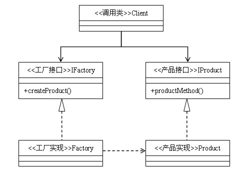

## 抽象工厂模式
### 定义：为创建一组相关或相互依赖的对象提供一个接口，而且无需指定他们的具体类。
### 类型：创建类模式
### 类图：

### 抽象工厂模式与工厂方法模式的区别

抽象工厂模式是工厂方法模式的升级版本，他用来创建一组相关或者相互依赖的对象。他与工厂方法模式的区别就在于，工厂方法模式针对的是一个产品等级结构；而抽象工厂模式则是针对的多个产品等级结构。在编程中，通常一个产品结构，表现为一个接口或者抽象类，也就是说，工厂方法模式提供的所有产品都是衍生自同一个接口或抽象类，而抽象工厂模式所提供的产品则是衍生自不同的接口或抽象类。

在抽象工厂模式中，有一个`产品族`的概念：所谓的产品族，是指`位于不同产品等级结构中功能相关联的产品组成的家族`。抽象工厂模式所提供的一系列产品就组成一个产品族；而工厂方法提供的一系列产品称为一个等级结构。我们依然拿生产汽车的例子来说明他们之间的区别。