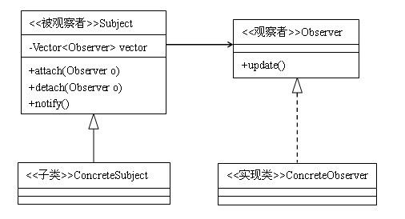

## 观察者模式
### 定义：定义对象间一种一对多的依赖关系，使得当每一个对象改变状态，则所有依赖于它的对象都会得到通知并自动更新。

### 类型：行为类模式

### 类图：



在软件系统中经常会有这样的需求：如果一个对象的状态发生改变，某些与它相关的对象也要随之做出相应的变化。比如，我们要设计一个右键菜单的功能，只要在软件的有效区域内点击鼠标右键，就会弹出一个菜单；再比如，我们要设计一个自动部署的功能，就像eclipse开发时，只要修改了文件，eclipse就会自动将修改的文件部署到服务器中。这两个功能有一个相似的地方，那就是一个对象要时刻监听着另一个对象，只要它的状态一发生改变，自己随之要做出相应的行动。其实，能够实现这一点的方案很多，但是，无疑使用观察者模式是一个主流的选择。

### 观察者模式的结构

在最基础的观察者模式中，包括以下四个角色：

* 被观察者：从类图中可以看到，类中有一个用来存放观察者对象的Vector容器（之所以使用Vector而不使用List，是因为多线程操作时，Vector在是安全的，而List则是不安全的），这个Vector容器是被观察者类的核心，另外还有三个方法：attach方法是向这个容器中添加观察者对象；detach方法是从容器中移除观察者对象；notify方法是依次调用观察者对象的对应方法。这个角色可以是接口，也可以是抽象类或者具体的类，因为很多情况下会与其他的模式混用，所以使用抽象类的情况比较多。
* 观察者：观察者角色一般是一个接口，它只有一个update方法，在被观察者状态发生变化时，这个方法就会被触发调用。
* 具体的被观察者：使用这个角色是为了便于扩展，可以在此角色中定义具体的业务逻辑。
* 具体的观察者：观察者接口的具体实现，在这个角色中，将定义被观察者对象状态发生变化时所要处理的逻辑。

### 观察者模式代码实现
```java
abstract class Subject {
    private Vector obs = new Vector();

    public void addObserver(Observer obs){
        this.obs.add(obs);
    }
    public void delObserver(Observer obs){
        this.obs.remove(obs);
    }
    protected void notifyObserver(){
        for(Observer o: obs){
            o.update();
        }
    }
    public abstract void doSomething();
}

class ConcreteSubject extends Subject {
    public void doSomething(){
        System.out.println("被观察者事件反生");
        this.notifyObserver();
    }
}
interface Observer {
    public void update();
}
class ConcreteObserver1 implements Observer {
    public void update() {
        System.out.println("观察者1收到信息，并进行处理。");
    }
}
class ConcreteObserver2 implements Observer {
    public void update() {
        System.out.println("观察者2收到信息，并进行处理。");
    }
}

public class Client {
    public static void main(String[] args){
        Subject sub = new ConcreteSubject();
        sub.addObserver(new ConcreteObserver1()); //添加观察者1
        sub.addObserver(new ConcreteObserver2()); //添加观察者2
        sub.doSomething();
    }
}
```
运行结果

```
被观察者事件反生

观察者1收到信息，并进行处理。

观察者2收到信息，并进行处理。
```

通过运行结果可以看到，我们只调用了Subject的方法，但同时两个观察者的相关方法都被同时调用了。仔细看一下代码，其实很简单，无非就是在Subject类中关联一下Observer类，并且在doSomething方法中遍历一下Observer的update方法就行了。

### 观察者模式的优点

观察者与被观察者之间是属于轻度的关联关系，并且是抽象耦合的，这样，对于两者来说都比较容易进行扩展。

观察者模式是一种常用的触发机制，它形成一条触发链，依次对各个观察者的方法进行处理。但同时，这也算是观察者模式一个缺点，由于是链式触发，当观察者比较多的时候，性能问题是比较令人担忧的。并且，在链式结构中，比较容易出现循环引用的错误，造成系统假死。

### 总结

java语言中，有一个接口Observer，以及它的实现类Observable，对观察者角色常进行了实现。我们可以在jdk的api文档具体查看这两个类的使用方法。

做过VC++、javascript DOM或者AWT开发的朋友都对它们的事件处理感到神奇，了解了观察者模式，就对事件处理机制的原理有了一定的了解了。如果要设计一个事件触发处理机制的功能，使用观察者模式是一个不错的选择，AWT中的事件处理DEM（委派事件模型Delegation Event Model）就是使用观察者模式实现的。