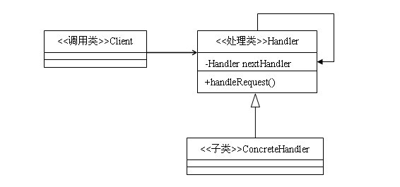

责任连模式
### 定义：使多个对象都有机会处理请求，从而避免了请求的发送者和接收者之间的耦合关系。将这些对象连成一条链，并沿着这条链传递该请求，直到有对象处理它为止。

### 类型：行为类模式

### 类图：




首先来看一段代码：
```java
public void test(int i, Request request){
    if(i==1){
        Handler1.response(request);
    }else if(i == 2){
        Handler2.response(request);
    }else if(i == 3){
        Handler3.response(request);
    }else if(i == 4){
        Handler4.response(request);
    }else{
        Handler5.response(request);
    }
}
```

代码的业务逻辑是这样的，方法有两个参数：整数i和一个请求request，根据i的值来决定由谁来处理request，如果i==1，由Handler1来处理，如果i==2，由Handler2来处理，以此类推。在编程中，这种处理业务的方法非常常见，所有处理请求的类有if…else…条件判断语句连成一条责任链来对请求进行处理，相信大家都经常用到。这种方法的优点是非常直观，简单明了，并且比较容易维护，但是这种方法也存在着几个比较令人头疼的问题：

* 代码臃肿：实际应用中的判定条件通常不是这么简单地判断是否为1或者是否为2，也许需要复杂的计算，也许需要查询数据库等等，这就会有很多额外的代码，如果判断条件再比较多，那么这个if…else…语句基本上就没法看了。
* 耦合度高：如果我们想继续添加处理请求的类，那么就要继续添加else if判定条件；另外，这个条件判定的顺序也是写死的，如果想改变顺序，那么也只能修改这个条件语句。

既然缺点我们已经清楚了，就要想办法来解决。这个场景的业务逻辑很简单：如果满足条件1，则由Handler1来处理，不满足则向下传递；如果满足条件2，则由Handler2来处理，不满足则继续向下传递，以此类推，直到条件结束。其实改进的方法也很简单，就是把判定条件的部分放到处理类中，这就是责任连模式的原理。

### 责任连模式的结构

责任连模式的类图非常简单，它由一个抽象地处理类和它的一组实现类组成：

* 抽象处理类：抽象处理类中主要包含一个指向下一处理类的成员变量nextHandler和一个处理请求的方法handRequest，handRequest方法的主要主要思想是，如果满足处理的条件，则有本处理类来进行处理，否则由nextHandler来处理。
* 具体处理类：具体处理类主要是对具体的处理逻辑和处理的适用条件进行实现。

了解了责任连模式的大体思想之后，再看代码就比较好理解了：
```java
class Level {
    private int level = 0;
    public Level(int level){
        this.level = level;
    }

    public boolean above(Level level){
        if(this.level >= level.level){
            return true;
        }
        return false;
    }
}

class Request {
    Level level;
    public Request(Level level){
        this.level = level;
    }

    public Level getLevel(){
        return level;
    }
}

class Response {

}

abstract class Handler {
    private Handler nextHandler;
    public final Response handleRequest(Request request){
        Response response = null;

        if(this.getHandlerLevel().above(request.getLevel())){
            response = this.response(request);
        }else{
            if(this.nextHandler != null){
                this.nextHandler.handleRequest(request);
            }else{
                System.out.println("-----没有合适的处理器-----");
            }
        }
        return response;
    }
    public void setNextHandler(Handler handler){
        this.nextHandler = handler;
    }
    protected abstract Level getHandlerLevel();
    public abstract Response response(Request request);
}

class ConcreteHandler1 extends Handler {
    protected Level getHandlerLevel() {
        return new Level(1);
    }
    public Response response(Request request) {
        System.out.println("-----请求由处理器1进行处理-----");
        return null;
    }
}

class ConcreteHandler2 extends Handler {
    protected Level getHandlerLevel() {
        return new Level(3);
    }
    public Response response(Request request) {
        System.out.println("-----请求由处理器2进行处理-----");
        return null;
    }
}

class ConcreteHandler3 extends Handler {
    protected Level getHandlerLevel() {
        return new Level(5);
    }
    public Response response(Request request) {
        System.out.println("-----请求由处理器3进行处理-----");
        return null;
    }
}

public class Client {
    public static void main(String[] args){
        Handler handler1 = new ConcreteHandler1();
        Handler handler2 = new ConcreteHandler2();
        Handler handler3 = new ConcreteHandler3();

        handler1.setNextHandler(handler2);
        handler2.setNextHandler(handler3);

        Response response = handler1.handleRequest(new Request(new Level(4)));
    }
}
```

代码中Level类是模拟判定条件；Request，Response分别对应请求和响应；抽象类Handler中主要进行条件的判断，这里模拟一个处理等级，只有处理类的处理等级高于Request的等级才能处理，否则交给下一个处理者处理。在Client类中设置好链的前后执行关系，执行时将请求交给第一个处理类，这就是责任连模式，它完成的功能与前文中的if…else…语句是一样的。

### 责任链模式的优缺点

责任链模式与if…else…相比，他的耦合性要低一些，因为它把条件判定都分散到了各个处理类中，并且这些处理类的优先处理顺序可以随意设定。责任链模式也有缺点，这与if…else…语句的缺点是一样的，那就是在找到正确的处理类之前，所有的判定条件都要被执行一遍，当责任链比较长时，性能问题比较严重。

### 责任链模式的适用场景

就像开始的例子那样，假如使用if…else…语句来组织一个责任链时感到力不从心，代码看上去很糟糕时，就可以使用责任链模式来进行重构。

### 总结

责任链模式其实就是一个灵活版的if…else…语句，它就是将这些判定条件的语句放到了各个处理类中，这样做的优点是比较灵活了，但同样也带来了风险，比如设置处理类前后关系时，一定要特别仔细，搞对处理类前后逻辑的条件判断关系，并且注意不要在链中出现循环引用的问题。